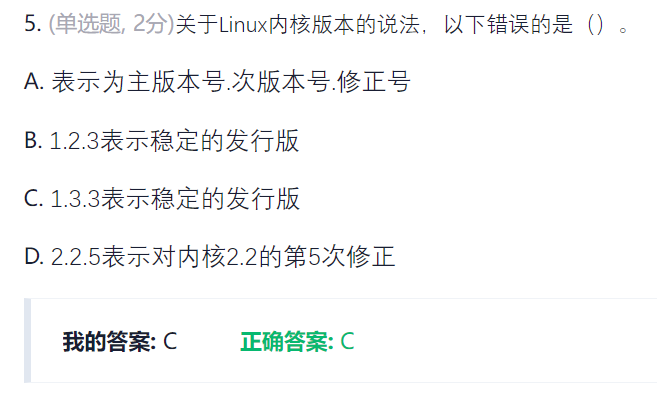

# 第一章
###### Linux的创始人     
    
----
###### 开源协议  
GPL/LGPL/Apache/BSD   
自由使用、修改和再发布，但版权留下   
----
###### Linux内核版本   
   
开发版添功能，稳定版打补丁   

----
# 第一章作业   
1. 重启shutdown  -r   
2. 关机shutdown -h   
3.     
4. Linux最初是以MINIX操作系统开发出来的   
5.     
第二位数字奇数为不稳定的开发版，偶数为稳定版本
6.     
   
7. 在Unix/Linux系统中，默认情况下，root的提示符为#，一般用户的提示符为$。   
8. 一个目录文件内至少要有两个文件项：（.）-当前目录；（..）-上级目录或父目录。当前目录也叫工作目录
9.   
对应知识点 ：   
    
10.        

----
# 第一章实验    

whoami 查看当前用户   
who 查看当前系统登录用户  
在终端或仿真终端输入命令poweroff 可以关机  

