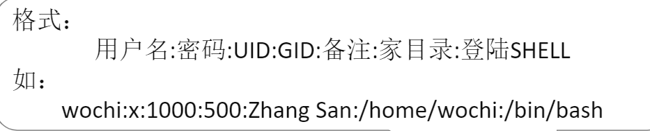
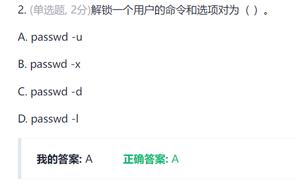

# 第三章 用户、组、身份认证
## 一些概念：

### 多任务系统：
多个人可以同时登录并使用的计算机系统       

###  用户：
用户的组成部分：用户名，用户ID，口令，属组，家目录，登录shell

/etc/passwd    

/etc/shadow    

/etc/group     

用户类型：  
超级用户root ： 无限权限
系统用户： 用于特殊应用，权限受限
普通用户： 用于一般用户登录，权限受限，可以浏览大部分的系统文件

### 组
    

1. 组成：
* 组群名
* 组群ID
* 组里面包含的所有用户
2. 组类型:
* 系统组群
* 普通组群
3. 保存文件：
* /etc/group   
  
* /etc/gshadow

### 组和用户用到的常用指令
       

# 作业：   
1.    
2.    
涉及知识点： passwd    
   

3.   

4.    
5.    
6.     

