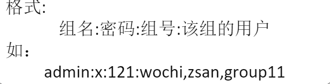

# 第三章 用户、组、身份认证
## 一些概念：

### 多任务系统：
多个人可以同时登录并使用的计算机系统       

----

###  用户：
用户的组成部分：用户名，用户ID，口令，属组，家目录，登录shell

/etc/passwd    

/etc/shadow    

/etc/group     

用户类型：   
超级用户root ： 无限权限
系统用户： 用于特殊应用，权限受限
普通用户： 用于一般用户登录，权限受限，可以浏览大部分的系统文件

----

### 组
    

1. 组成：
* 组群名
* 组群ID
* 组里面包含的所有用户
2. 组类型:
* 系统组群
* 普通组群
3. 保存文件：
* /etc/group   
  
* /etc/gshadow

----

### 组和用户用到的常用指令
       

----

# 作业：   
1. 知识点： passwd   
   
例题：   
   
   
   
   

2. 知识点： 用户添加，修改和删除    
   
   
   
例题：      
  

   

4. 知识点： /etc/group     /etc/passwd  /etc/shadow
* 用户组的所有信息都存放在/etc/group文件中  
* /etc/passwd是用户数据库，其中的域给出了用户名、加密口令和用户的其他信息. 
* /etc/shadow是在安装了影子(shadow)口令软件的系统上的影子口令文件。影子口令文件将/etc/passwd 文件中的加密口令移动到/etc/shadow中，而后者只对超级用户root可读。这使破译口令更困难，以此增加系统的安全性。

    
例题：   
    
     

5. 组的添加修改和删除   
* 添加  
   

* 修改  
groupmod命令用于更改群组的识别码或名称时。不过大家还是要注意，用户名不要随意修改，组名和 GID 也不要随意修改，因为非常容易导致管理员逻辑混乱。如果非要修改用户名或组名，则建议大家先删除旧的，再建立新的。

语法格式：groupmod [参数]

常用参数：

-g	设置欲使用的群组识别码
-o 	重复使用群组识别码
-n	设置欲使用的群组名称

* 删除   
   

----

# 重点： su和sudo的区别    

      

1、内容不同：

su命令：用来切换用户，substitute英文含义“代替”的意思。

sudo命令：sudo为superuser do 的简写，即使用超级用户来执行命令，一般是指root用户。

2、用法不同：

su命令：不加用户名默认是切换为root用户，切当前目录不改变，其他环境变量不变。

sudo命令： 查看当前用户可以用sudo执行的命令都有哪些。

3、环境不同：

su命令：切换到root用户，但是并没有转到root用户家目录下，即没有改变用户的环境。

sudo命令：是当前用户切换到root，然后以root身份执行命令，执行完成后，直接退回到当前用户，而这些的前提是要通过sudo的配置文件/etc/sudoers来进行授权

P47，（1），（3），（4）    