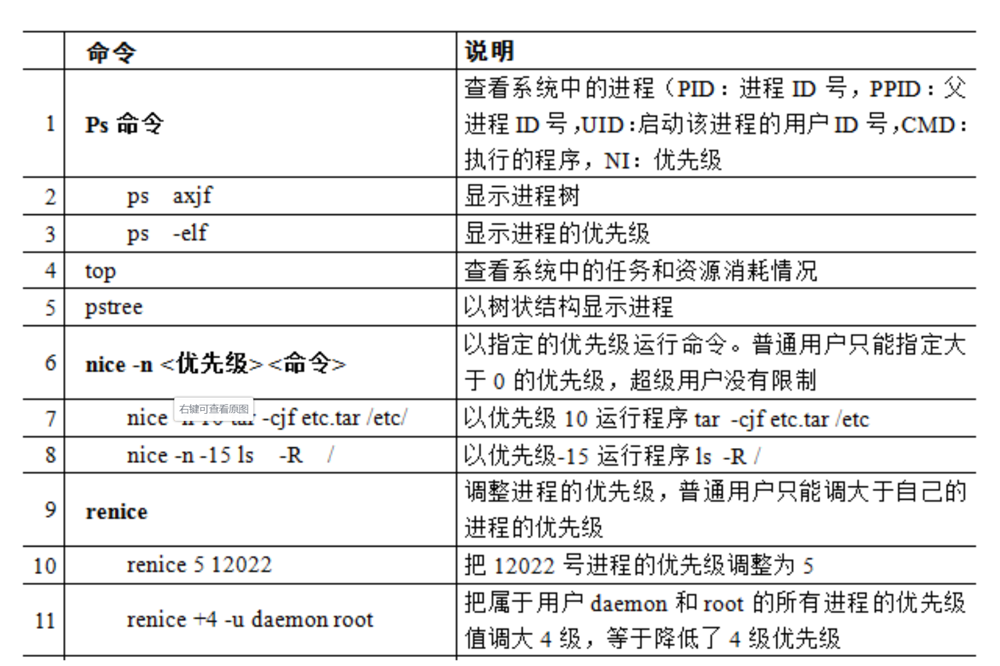

# 进程管理命令
    

    

# 查询网络使用情况相关命令
    

# 定时任务： 在将来某个时间执行命令   
1. 周期性定时任务
crontab    
   注意：新创建的 cron 任务，不会马上执行，至少要过 2 分钟后才可以，当然你可以重启 cron 来马上执行。

而 linux 任务调度的工作主要分为以下两类：     
1、系统执行的工作：系统周期性所要执行的工作，如备份系统数据、清理缓存    
2、个人执行的工作：某个用户定期要做的工作，例如每隔 10 分钟检查邮件服务器是否有新信，这些工作可由每个用户自行设置   

   
   
2. 一次性定时任务   

at  安排普通的一次性定时任务   

batch     安排条件定时任务    

     