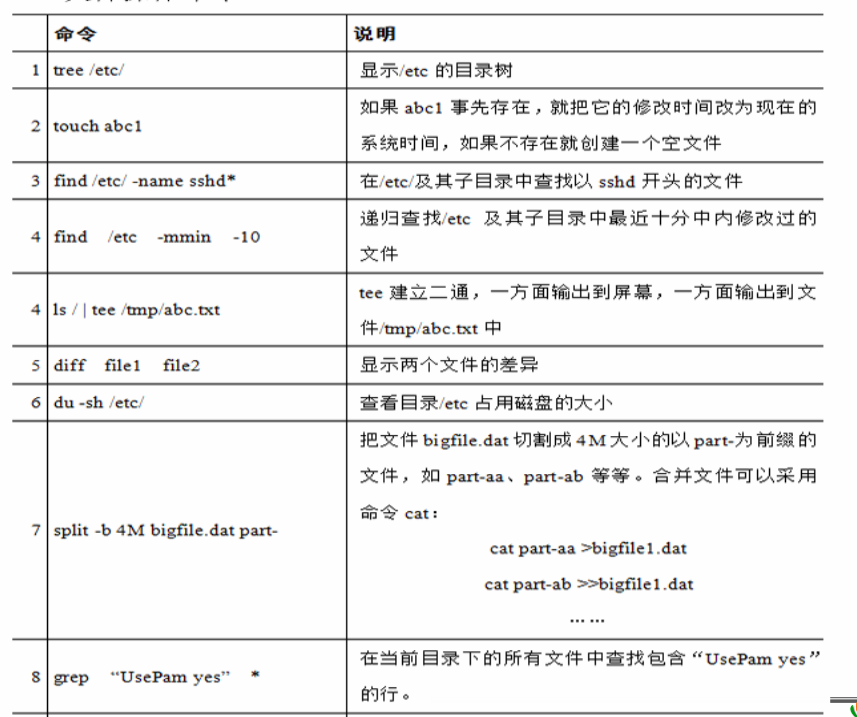
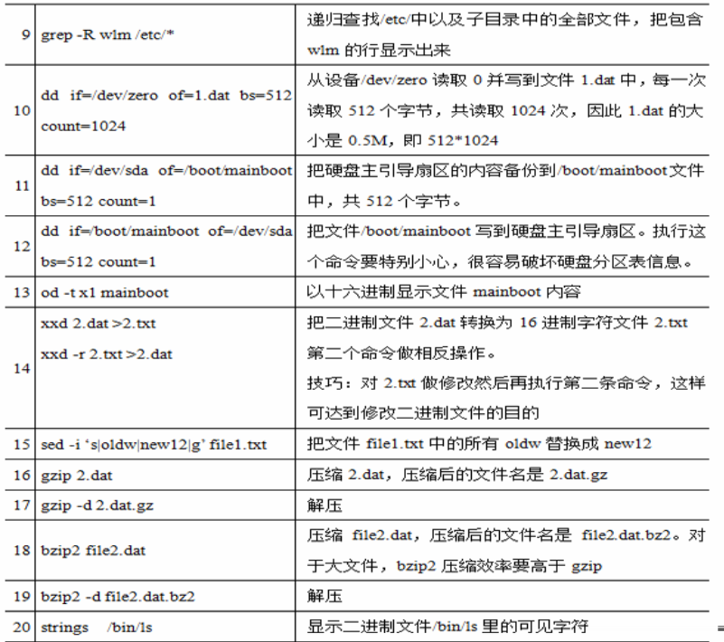
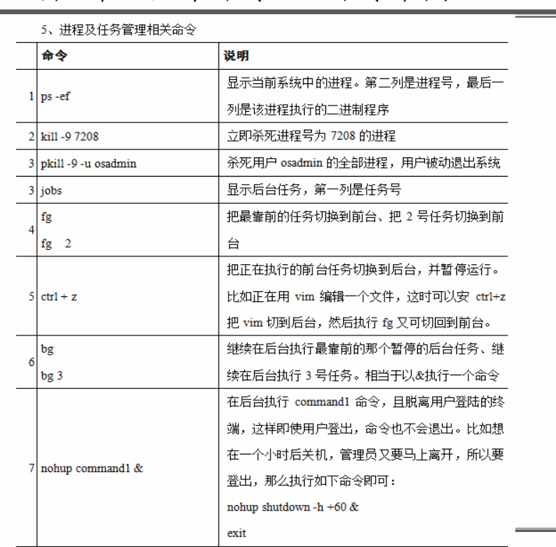
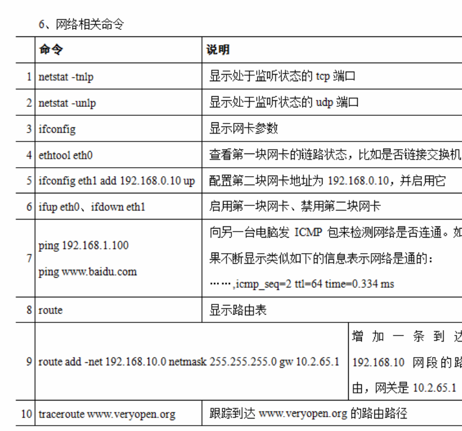

# 重定向、管道机制

重定向简介  
计算机最基础的功能是可以提供输入输出操作。对于Linux系统来说，通常以键盘为默认输入设备，又称标准输入设备；以显示器为默认的输出设备，又称标准输出设备。所谓重定向，就是将原本应该从标准输入设备（键盘）输入的数据，改由其他文件或设备输入，或将原本应该输出到标准输出设备（显示器）的内容，改由输出到其他文件或设备上。

管道命令可以将多条命令组合起来，一次性完成复杂的处理任务。
使用重定向字符控制输出到文件，使用管道控制输出到其他程序

详情看下面
<https://blog.csdn.net/qq_52302132/article/details/124706011>

文件操作命令
   
    
进程、任务管理命令
   
服务管理工具      

网络相关命令   
    

