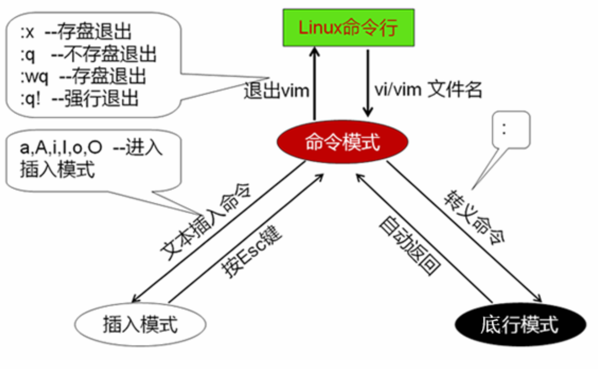
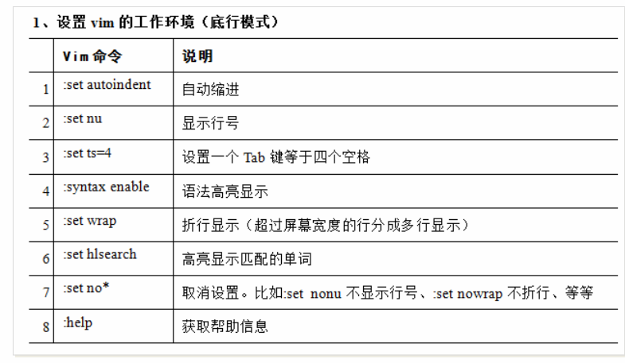
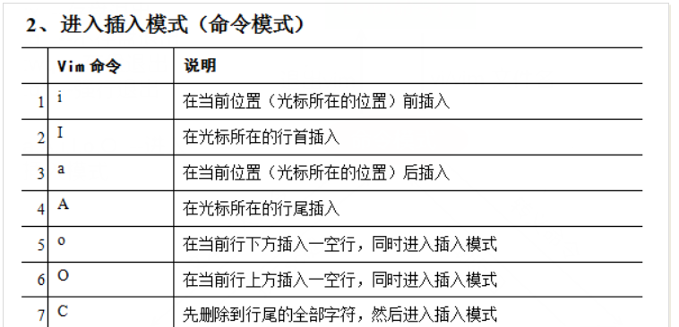
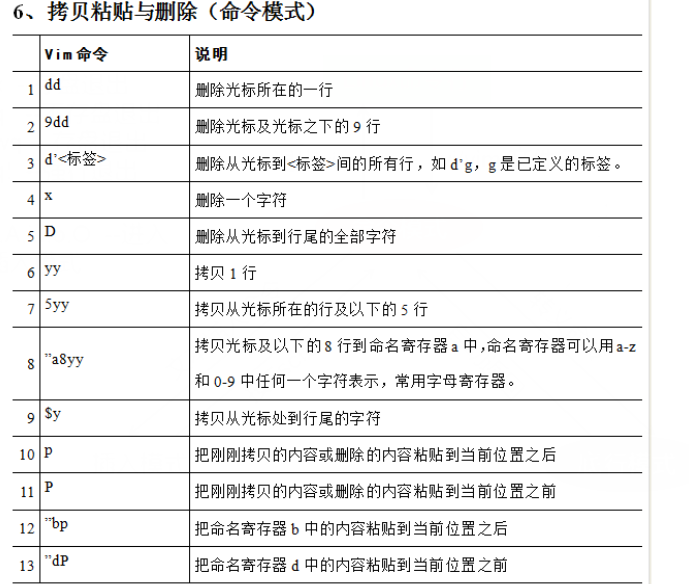

#  vim     
### vi/vim的三种工作模式
       

底行模式   
    

命令模式   
   
    

### vi/vim的基本用法退出     
命令模式下退出    
:x 存盘退出     
:q 不存盘退出
:wq 存盘退出   
:q! 强行退出   
:w 存盘不退出  
ctrl + z 把vim切换到后台，此后在bash命令行执行fg可以切换回来      