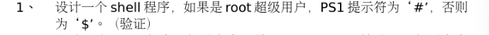
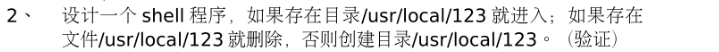
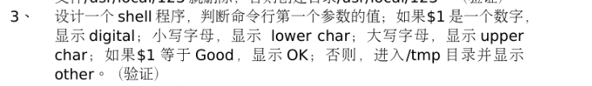
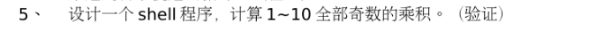
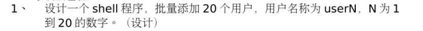
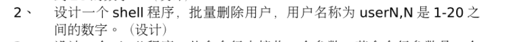
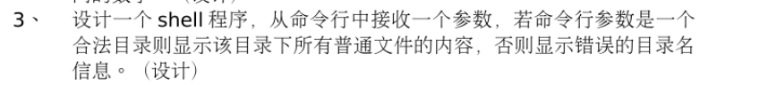
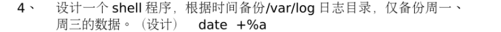
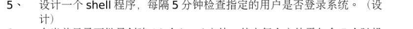
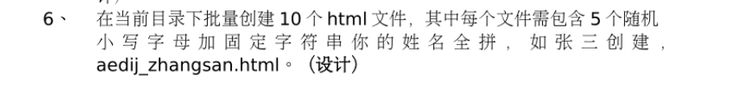

Shell程序就是包含一系列的linux命令和控制语句而已     

<https://blog.csdn.net/weixin_49343190/article/details/120983328>   

<https://blog.csdn.net/qq_36154886/article/details/94982168>    

# 习题  
1. 统计1-100的和     
     

----


2.   
     

3.      


4. 
    


# 实验的五题  
1.       

注意`` 和 '' 的区别
```shell
#!/bin/bash
if[ `id -u` -eq 0 ]
then 
  PS1='#'
else 
  PS1='$'
fi 
```

2.    
```shell
#!/bin/bash 
file=/usr/local/123
if test -d $file
then
  cd $file
elif [ -f $file ]
then  
  rm $file
else
  mkdir $file
fi
```     

3.    
```shell
#!/bin/bash   
case $1 in 
         [0-9]) echo "digital";;
         [a-z]) echo "lower char";;
         [A-Z]) echo "upper char";;
         "Good") echo "OK";;
         *) echo "other";;
esac  
```

4.    
```shell
#!/bin/bash
for file in * 
do
  [ -f $file ] && mv $file $file.old
  [ -d $file ] && break
done
```


5.    
```shell
#!/bin/bash 
total=1
for (( i=1; i<10; i++)) 
do
  [ $[ $i % 2] -eq  0 ] && continue
  total=$[$total * $i]
done
  echo $total
```

1.    
```shell
#!/bin/bash 
user=user
for i in {1..20} 
do 
  name="${user}${i}"
  useradd $name
done   
```


2.    
```shell 
#!/bin/bash
filename=$(ls -l /home | grep "^user" | awk '{print $9}')
for file in filename 
do
userdel -rf $file 
done  
```

3.    
```shell
#!/bin/bash
dir=$1
if [ -d $dir] 
then
  cd $dir
  for file in * 
  do
    if [-f $file] 
    then echo ${}

```


4.    
```shell


```


5.   
```shell

```


6.    
```shell


```