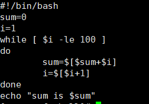
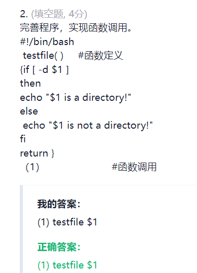
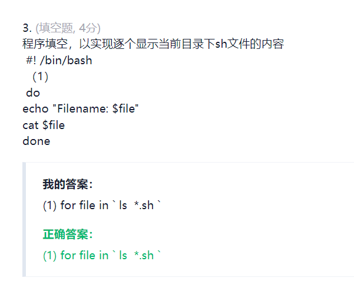

Shell程序就是包含一系列的linux命令和控制语句而已     

<https://blog.csdn.net/weixin_49343190/article/details/120983328>   

<https://blog.csdn.net/qq_36154886/article/details/94982168>    

# 习题  
1. 统计1-100的和     
     

----

2.   
     

3.      

4. 
    

5. 