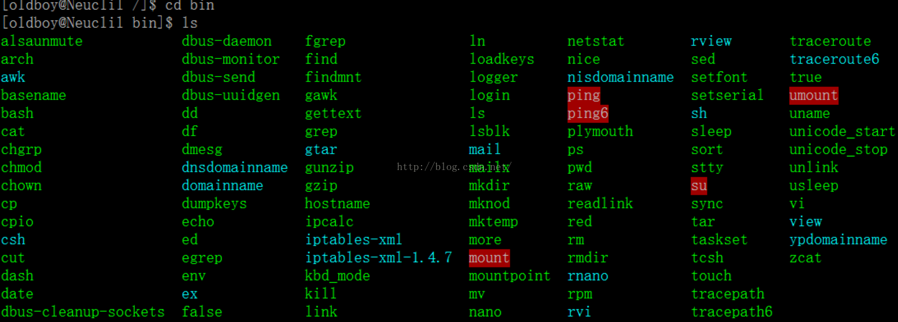
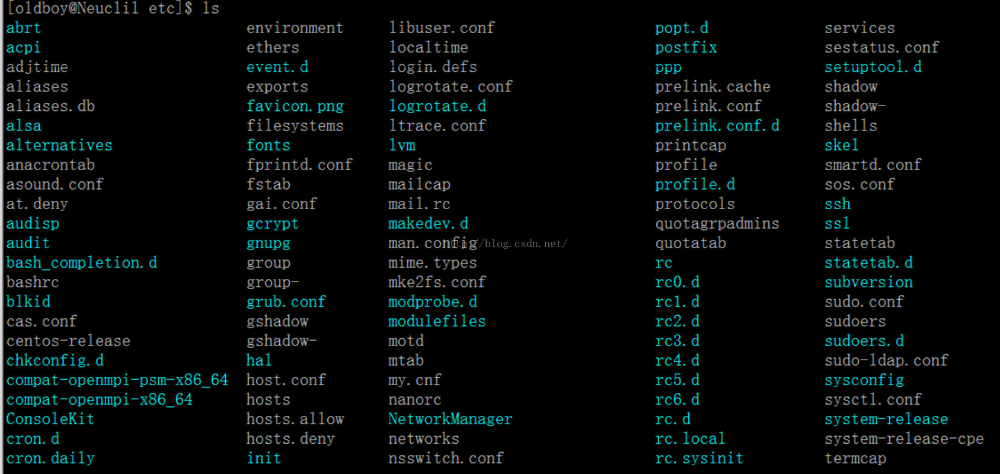
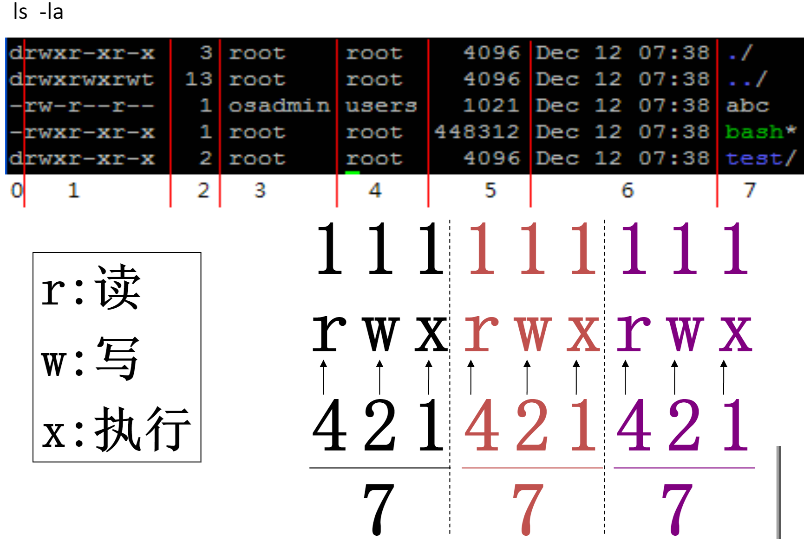
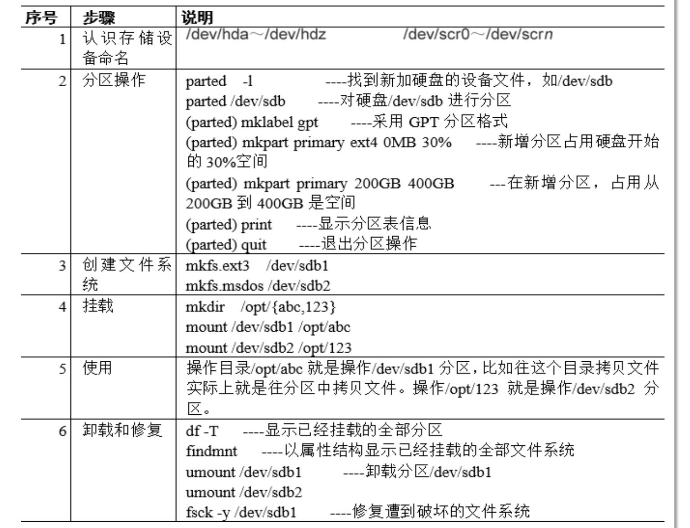

# Linux目录树     

     

a)   根目录（/）

根目录是整个系统最重要的一个目录，因为所有的目录都是由根目录衍生出来的。只有root用户才具有在该目录下写权限。

b)   /bin目录 – 用户二进制文件

包含二进制的可执行文件，你需要的常见的Linux命令都位于此目录下。
   

c)   /sbin目录 – 系统二进制文件

这个目录下的命令通常由系统管理员使用， 对系统进行维护。
   

d)   /etc– 配置文件

包含所有程序所需要的配置文件，也包含用于启动/停止单个程序的起动和关闭shell脚本。

   
e)   /dev-设备文件

包含设备文件，包括终端设备、USB或连接到系统的任何设备，如网卡等。

    
f)   /proc-进程信息文件

这是一个虚拟的文件系统，包含有关正在运行的进程信息。

g)   /var-变量文件

包含目录下内容可变的文件，例如，系统日志文件（/var/log）;包和数据库文件（/var/lib）;电子邮件（/var/mail）;打印队列（/var/spool）;锁文件（/var/lock）;多次重新启动需要的临时文件（/var/tmp）。

h)   /tem-临时文件

包含系统和用户创建的临时文件，当系统重启时，文件消失。

i)   /usr-用户程序

包含二进制文件、库文件、文档和二级程序的源代码。

/usr/bin中包含用户程序的二进制文件。如果你在/bin中找不到用户二进制文件，到/usr/bin目录看看。例如：at、awk、cc、less、scp。
/usr/sbin中包含系统管理员的二进制文件。如果你在/sbin中找不到系统二进制文件，到/usr/sbin目录看看。例如：atd、cron、sshd、useradd、userdel。
/usr/lib中包含了/usr/bin和/usr/sbin用到的库。
/usr/local中包含了从源安装的用户程序。例如，当你从源安装Apache，它会在/usr/local/apache2中

j)  /home -HOME目录

包含所有用户的个人档案，Linux是多用户的系统，所以用该目录保存各用户的信息。

k)  /boot -引导加载程序

包含引导加载程序相关的文件。

l)  /lib -系统库

包含支持位于/lib和/sbin下的二进制文件的库文件。

m)  /opt -可选的附加应用程序

n)  /mnt -挂载目录

----

# 文件权限和分类   

### 文件分类  

    

    

### 文件权限  
    

----

# 文件操作命令  

### 权限管理命令   
1. chmod 

2. chown 

3. chgrp   

### 通配符   

### 文件操作   
ls   
   
tar   
    

----

# 创建文件系统   
    

----

----
# 习题      

# 复习重点   
P47，（1），（2），（3）

Linux目录树

文件权限和分类，相关命令，suid，sgid，sticky

文件操作命令

创建文件系统     