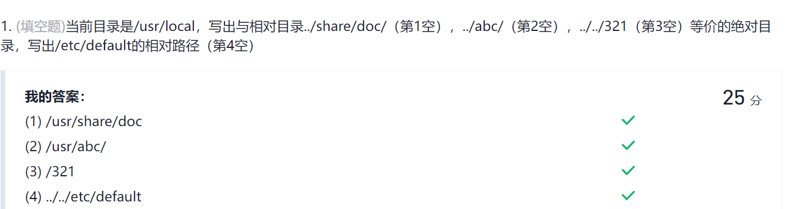

 
# 1. Linux目录树     

     

a)   根目录（/）

根目录是整个系统最重要的一个目录，因为所有的目录都是由根目录衍生出来的。只有root用户才具有在该目录下写权限。

b)   /bin目录 – 用户二进制文件

包含二进制的可执行文件，你需要的常见的Linux命令都位于此目录下。
   

c)   /sbin目录 – 系统二进制文件

这个目录下的命令通常由系统管理员使用， 对系统进行维护。
   


d)   /etc– 配置文件

包含所有程序所需要的配置文件，也包含用于启动/停止单个程序的起动和关闭shell脚本。

   
e)   /dev-设备文件

包含设备文件，包括终端设备、USB或连接到系统的任何设备，如网卡等。

    
f)   /proc-进程信息文件

这是一个虚拟的文件系统，包含有关正在运行的进程信息。


g)   /var-变量文件

包含目录下内容可变的文件，例如，系统日志文件（/var/log）;包和数据库文件（/var/lib）;电子邮件（/var/mail）;打印队列（/var/spool）;锁文件（/var/lock）;多次重新启动需要的临时文件（/var/tmp）。

 
h)   /tem-临时文件

包含系统和用户创建的临时文件，当系统重启时，文件消失。


i)   /usr-用户程序

包含二进制文件、库文件、文档和二级程序的源代码。

/usr/bin中包含用户程序的二进制文件。如果你在/bin中找不到用户二进制文件，到/usr/bin目录看看。例如：at、awk、cc、less、scp。
/usr/sbin中包含系统管理员的二进制文件。如果你在/sbin中找不到系统二进制文件，到/usr/sbin目录看看。例如：atd、cron、sshd、useradd、userdel。
/usr/lib中包含了/usr/bin和/usr/sbin用到的库。
/usr/local中包含了从源安装的用户程序。例如，当你从源安装Apache，它会在/usr/local/apache2中


j)  /home -HOME目录

包含所有用户的个人档案，Linux是多用户的系统，所以用该目录保存各用户的信息。


k)  /boot -引导加载程序

包含引导加载程序相关的文件。


l)  /lib -系统库

包含支持位于/lib和/sbin下的二进制文件的库文件。


m)  /opt -可选的附加应用程序


n)  /mnt -挂载目录

### 习题  
     

----

# 2.文件权限和分类   

### 文件分类  

    

    

### 文件权限  
    

默认的最大权限   
* 对文件来讲，其可拥有的最大默认权限是 666，即 rw-rw-rw-。也就是说，使用文件的任何用户都没有执行（x）权限。原因很简单，执行权限是文件的最高权限，赋予时绝对要慎重，因此绝不能在新建文件的时候就默认赋予，只能通过用户手工赋予。      
* 对目录来讲，其可拥有的最大默认权限是 777，即 rwxrwxrwx。    
文件的最大权限   
* 755代表 rwxr-xr-x,表示user权限为可读可写可执行，group权限为可读可执行，other权限为可读可执行，755代表了文件的最大权限    

### 习题  
    
   


----

# 3. 文件操作命令

----


### 知识点  

### 权限管理命令   
###### 1. chmod
```
                 u    用户user，表现文件或目录的所有者

                 g    用户组group，表现文件或目录所属的用户组

                 o    其他用户other

                 a    所有用户all

```
操作符  +:添加权限 -减少权限 =直接赋予权限       
权限：r w x     read  write   execute  
八进制数字表示权限    
   

语法：  
chmod u+x 文件名
chmod 755文件名

    


###### 2. chown    
   chown命令改变某个文件或目录的所有者和所属的组，该命令可以向某个用户授权，使该用户变成指定文件的所有者或者改变文件所属的组。用户可以是用户或者是用户D，用户组可以是组名或组id。文件名可以使由空格分开的文件列表，在文件名中可以包含通配符。    
   只有文件主和超级用户才可以便用该命令。  

    


###### 3. chgrp   
命令用于变更文件或目录的所属群组，和chown不同，chgrp允许普通用户修改组，只要该用户是组内的一员      

     


###### 4. suid
    

###### 5. sgid
    

###### 6. sticky
     
    
### 通配符   


### 文件操作   
ls   
   
tar   
    

----  
### 相关习题   

    

    
首先suid默认代号4000，sgid默认代号2000，加起来6000，然后这些系统命令的执行权限默认是755,存储在/usr/sbin系统管理员的二进制文件目录下    
    
----

# 4. 创建文件系统 
### 知识点    
    

### 相关习题  
    

   
dd：拷贝及转换文件   
cdrecord： 光盘刻录工具     

    
umount命令来自于英文单词unmount的缩写，其功能是用于卸载文件系统。与mount挂载命令需要同时提供设备名与挂载目录不同，umount卸载命令只需要提供设备名或挂载目录之一即可      

    

    

   

    

    